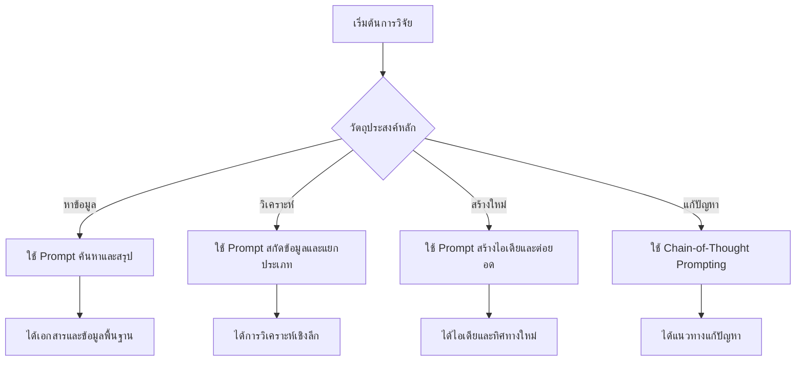

# 🔬 LLM Research Prompts: คู่มือ Prompt สำหรับการวิจัย

> รวมรวม prompt ที่ช่วยเพิ่มประสิทธิภาพในการวิจัยด้วย Large Language Models (LLMs) ตั้งแต่การหาเอกสาร การสรุปข้อมูล ไปจนถึงการสร้างความรู้ใหม่

[](https://opensource.org/licenses/MIT)
[](#)
[](#)
[](http://makeapullrequest.com)

## 📋 สารบัญ

- [🎯 ภาพรวม](#ภาพรวม)
- [🔍 การค้นหาและรวบรวมข้อมูล](#การค้นหาและรวบรวมข้อมูล)
- [📊 การวิเคราะห์และสรุปผล](#การวิเคราะห์และสรุปผล)
- [💡 การสร้างความรู้ใหม่](#การสร้างความรู้ใหม่)
- [🧠 เทคนิคขั้นสูง](#เทคนิคขั้นสูง)
- [📈 ตารางสรุปเทคนิค](#ตารางสรุปเทคนิค)
- [⚠️ ข้อควรระวัง](#ข้อควรระวัง)
- [📚 แหล่งอ้างอิง](#แหล่งอ้างอิง)

---

## 🎯 ภาพรวม

### ความสำคัญของ Prompt Engineering ในการวิจัย

การใช้ **Large Language Models (LLMs)** ในงานวิจัยได้รับความนิยมเพิ่มขึ้นอย่างมาก โดยเฉพาะในการ:

- 🔍 **ค้นหาและรวบรวมเอกสารวิจัย**
- 📝 **สรุปและวิเคราะห์ข้อมูล**
- 💡 **สร้างไอเดียและองค์ความรู้ใหม่**
- 🔄 **ต่อยอดงานวิจัยที่มีอยู่**

การออกแบบ **prompt ที่เหมาะสม** จึงเป็นกุญแจสำคัญในการใช้ LLMs ให้เกิดประสิทธิภาพสูงสุด

### 🎯 กลุ่มเป้าหมาย

คู่มือนี้เหมาะสำหรับ:
- 🎓 **นักศึกษาระดับบัณฑิตศึกษา**
- 👨‍🔬 **นักวิจัยมืออาชีพ**
- 👩‍🏫 **อาจารย์และผู้สอน**
- 📊 **นักวิเคราะห์ข้อมูล**
- 💼 **ผู้ที่ทำงานด้าน R&D**

---

## 🔍 การค้นหาและรวบรวมข้อมูล

### 📚 การค้นหาเอกสารวิจัย

#### 🎯 ค้นหาเอกสารล่าสุด
```
ค้นหางานวิจัยล่าสุดเกี่ยวกับ [หัวข้อเฉพาะ] 
ตีพิมพ์ในปีที่แล้ว จากแหล่งข้อมูลที่น่าเชื่อถือเช่น:
- arXiv
- PubMed  
- Google Scholar
- IEEE Xplore
- ACM Digital Library

ให้ข้อมูล: ชื่อเรื่อง, ผู้เขียน, บทคัดย่อ, และ DOI (ถ้ามี)
จัดเรียงตามความเกี่ยวข้องและจำนวนการอ้างอิง
```

**💡 ตัวอย่างการใช้งาน:**
```
ค้นหางานวิจัยล่าสุดเกี่ยวกับ "machine learning in drug discovery" 
ตีพิมพ์ในปี 2023-2024 จากแหล่งข้อมูลที่น่าเชื่อถือ...
```

#### 🔍 ค้นหาแบบเฉพาะเจาะจง
```
ค้นหางานวิจัยที่เกี่ยวข้องกับ [คำหลัก 1] AND [คำหลัก 2] 
ในช่วงปี [ปีเริ่มต้น] ถึง [ปีสิ้นสุด]

แบ่งประเภทตาม:
1. การศึกษาเชิงปริมาณ (Quantitative Studies)
2. การศึกษาเชิงคุณภาพ (Qualitative Studies)  
3. การทบทวนวรรณกรรม (Literature Reviews)
4. การศึกษาแบบผสมผสาน (Mixed Methods)

สำหรับแต่ละประเภท ให้:
- จำนวนเอกสารที่พบ
- เอกสารตัวอย่าง 3-5 ฉบับที่สำคัญที่สุด
- แนวโน้มการวิจัยในประเภทนั้น
```

#### 📈 การติดตามแนวโน้มการวิจัย
```
วิเคราะห์แนวโน้มการวิจัยในสาขา [ชื่อสาขา] ในช่วง 10 ปีที่ผ่านมา

ให้ข้อมูล:
1. หัวข้อวิจัยที่เป็นที่นิยมและเพิ่มขึ้น
2. หัวข้อวิจัยที่ลดลงหรือหายไป
3. ช่องว่างการวิจัยที่ยังไม่ได้ศึกษา
4. ทิศทางที่น่าจะมีการพัฒนาต่อไป
5. เทคโนโลยีหรือวิธีการใหม่ที่เกิดขึ้น

จัดทำเป็นไทม์ไลน์พร้อมจุดเปลี่ยนสำคัญ
```

### 🗂️ การจัดระบบข้อมูล

#### 🗺️ การสร้าง Literature Map
```
สร้างแผนที่วรรณกรรม (Literature Map) สำหรับหัวข้อ [ระบุหัวข้อ]

จัดกลุ่มงานวิจัยตาม:
1. แนวทางการศึกษา (Theoretical Approaches)
2. ระเบียบวิธีวิจัย (Research Methods)  
3. ผลการศึกษา (Findings)
4. ช่วงเวลาที่ศึกษา (Timeline)

แสดงความเชื่อมโยงระหว่างงานวิจัยต่างๆ:
- งานวิจัยพื้นฐานที่สำคัญ
- งานวิจัยที่อ้างอิงซึ่งกันและกัน
- ความขัดแย้งหรือข้อถกเถียง
- ช่องว่างที่ยังไม่ได้ศึกษา
```

#### 🔍 การตรวจสอบความน่าเชื่อถือ
```
ประเมินความน่าเชื่อถือของแหล่งข้อมูลต่อไปนี้:

[รายการแหล่งข้อมูล]

เกณฑ์การประเมิน:
1. ชื่อเสียงของวารสารหรือสำนักพิมพ์ (Impact Factor, Q-ranking)
2. คุณภาพของ peer review process
3. ความเป็นปัจจุบันของข้อมูล
4. ความโปร่งใสในการรายงานวิธีการ
5. การอ้างอิงจากเอกสารอื่น

ให้คะแนนความน่าเชื่อถือ (1-10) พร้อมเหตุผล
แนะนำแหล่งข้อมูลทางเลือกที่น่าเชื่อถือกว่า (ถ้ามี)
```

---

## 📊 การวิเคราะห์และสรุปผล

### 📝 การสรุปงานวิจัย

#### ⚡ สรุปแบบกระชับ
```
สรุปข้อสรุปสำคัญของงานวิจัย "[ชื่องานวิจัย]" ในรูปแบบต่อไปนี้:

📌 วัตถุประสงค์หลัก (1 ประโยค):
🔬 วิธีการศึกษา (1 ประโยค):  
📊 ผลการศึกษาสำคัญ (2-3 ประโยค):
⚠️ ข้อจำกัด (1 ประโยค):
🚀 ข้อเสนอแนะเพื่อการวิจัยต่อไป (1 ประโยค):

ใช้ภาษาที่เข้าใจง่าย หลีกเลี่ยงศัพท์เทคนิคที่ซับซ้อน
```

#### 🔍 การสรุปเชิงเปรียบเทียบ
```
เปรียบเทียบและสรุปผลการศึกษาจากงานวิจัย 3 ฉบับต่อไปนี้:

1. [งานวิจัยที่ 1]
2. [งานวิจัยที่ 2]  
3. [งานวิจัยที่ 3]

จัดทำการเปรียบเทียบในรูปแบบตาราง:

| ประเด็น | งานวิจัยที่ 1 | งานวิจัยที่ 2 | งานวิจัยที่ 3 |
|---------|-------------|-------------|-------------|
| วิธีการศึกษา | | | |
| กลุ่มตัวอย่าง | | | |
| ผลสำคัญ | | | |
| จุดแข็ง | | | |
| ข้อจำกัด | | | |

สรุปภาพรวม:
- จุดที่งานวิจัยทั้งสามเห็นด้วย
- จุดที่มีความขัดแย้งหรือแตกต่าง
- ข้อเสนอแนะสำหรับการวิจัยต่อไป
```

### 🔎 การสกัดข้อมูลสำคัญ

#### 📄 การวิเคราะห์บทคัดย่อ
```
สกัดข้อมูลหลักจากบทคัดย่อของงานวิจัย "[ชื่องานวิจัย]":

🎯 ปัญหาที่ศึกษา:
📋 วิธีการดำเนินการ:
👥 กลุ่มตัวอย่าง/ขนาดตัวอย่าง:
🛠️ เครื่องมือหรือเทคนิคที่ใช้:
📊 ผลการศึกษาหลัก (เชิงตัวเลข):
💡 นัยสำคัญทางปฏิบัติ:
🔄 ความเป็นไปได้ในการทำซ้ำ:
📈 ผลกระทบหรือการประยุกต์ใช้:

ระบุคำหลัก (Keywords) ที่สำคัญ: [5-7 คำ]
```

#### 🕳️ การระบุช่องว่างการวิจัย
```
วิเคราะห์ช่องว่าง (Research Gap) จากการทบทวนวรรณกรรมเรื่อง [หัวข้อ]

ระบุช่องว่างประเภทต่างๆ:

1. 📚 ช่องว่างด้านเนื้อหา (Content Gap):
   - สิ่งที่ยังไม่ได้ศึกษา
   - ตัวแปรที่ไม่ได้พิจารณา
   - ปรากฏการณ์ใหม่ที่เกิดขึ้น

2. 🔬 ช่องว่างด้านวิธีการ (Methodological Gap):
   - วิธีการศึกษาที่ยังไม่ได้ใช้
   - เครื่องมือใหม่ที่น่าสนใจ
   - การผสมผสานวิธีการ

3. 🌍 ช่องว่างด้านบริบท (Contextual Gap):
   - พื้นที่ที่ยังไม่ได้ศึกษา
   - กลุ่มประชากรที่ขาดการศึกษา
   - ช่วงเวลาที่แตกต่าง

4. 📈 ช่องว่างด้านแนวคิด (Conceptual Gap):
   - ทฤษฎีใหม่ที่ต้องพัฒนา
   - การเชื่อมโยงแนวคิดข้ามสาขา

จัดลำดับความสำคัญและเสนอแนวทางการวิจัยที่เป็นไปได้
```

---

## 💡 การสร้างความรู้ใหม่

### 🚀 การพัฒนาไอเดียวิจัย

#### 💭 การสร้างคำถามวิจัย
```
เสนอ 5 คำถามวิจัยใหม่ที่น่าสนใจสำหรับสาขา [ระบุสาขา] 

พิจารณาจากปัจจัยต่อไปนี้:
1. 🌍 สถานการณ์ปัจจุบันของโลก (โควิด-19, ภาวะโลกร้อน, AI Revolution)
2. 🚀 เทคโนโลยีใหม่ๆ (AI, Blockchain, Quantum Computing, CRISPR)
3. 📊 ข้อมูลใหญ่และ Big Data Analytics
4. 🏥 ความท้าทายทางสังคม (ความเหลื่อมล้ำ, การชรา, Sustainability)
5. 🕳️ ช่องว่างในองค์ความรู้ที่มีอยู่

สำหรับแต่ละคำถาม ให้ระบุ:
- 🎯 ความสำคัญและเหตุผลที่ควรศึกษา
- 📊 ความเป็นไปได้ในการศึกษา (Feasibility)
- 💰 ความต้องการทรัพยากร (งบประมาณ, เวลา, อุปกรณ์)
- 🌟 ผลกระทบที่คาดว่าจะเกิดขึ้น
- 🤝 ความเป็นไปได้ในการหาผู้ร่วมมือ
```

#### 🔄 การต่อยอดงานวิจัย
```
เสนอ 3 ไอเดียวิจัยใหม่ที่ต่อยอดจากสถานะปัจจุบันของการศึกษาเรื่อง [หัวข้อเฉพาะ]

สำหรับแต่ละไอเดีย ให้ออกแบบโครงการวิจัยเบื้องต้น:

**ไอเดียที่ 1:**
- 🎯 วัตถุประสงค์:
- ❓ คำถามวิจัยหลัก:
- 🔬 ระเบียบวิธีวิจัยที่เหมาะสม:
- 👥 กลุ่มตัวอย่าง/ขอบเขตการศึกษา:
- 📊 ผลที่คาดว่าจะได้รับ:
- 💡 ประโยชน์ที่จะเกิดขึ้น:
- ⏱️ ระยะเวลาที่คาดหวัง:
- 💰 งบประมาณเบื้องต้น:

[ทำซ้ำสำหรับไอเดียที่ 2 และ 3]

สรุปเปรียบเทียบทั้ง 3 ไอเดีย:
- ไอเดียไหนมีความเป็นไปได้สูงสุด
- ไอเดียไหนมีผลกระทบมากสุด
- ไอเดียไหนต้องการทรัพยากรน้อยสุด
```

### 🔗 การประยุกต์ข้ามสาขา

#### 🌐 การรวมศาสตร์ (Interdisciplinary Research)
```
เสนอแนวทางการวิจัยแบบสหวิทยาการ (Interdisciplinary Research) 
ที่ผสมผสานระหว่าง [สาขาที่ 1] และ [สาขาที่ 2] 
เพื่อแก้ปัญหา [ระบุปัญหา]

ออกแบบโครงการวิจัยเบื้องต้น:

🎯 **หลักการและเหตุผล:**
- ทำไมต้องใช้แนวทางข้ามสาขา
- จุดแข็งของแต่ละสาขาที่จะมาผสมผสาน
- ปัญหาที่ไม่สามารถแก้ได้ด้วยสาขาเดียว

🔬 **วิธีการดำเนินการ:**
- การรวมทฤษฎีจากทั้งสองสาขา
- การผสมผสานวิธีการวิจัย
- การจัดทีมนักวิจัยข้ามสาขา

⚠️ **ความท้าทายที่คาดว่าจะเจอ:**
- ความแตกต่างของภาษาและแนวคิด
- การประสานงานระหว่างทีม
- การตีพิมพ์ในวารสารที่เหมาะสม

📈 **ผลลัพธ์ที่คาดหวัง:**
- องค์ความรู้ใหม่ที่เกิดขึ้น
- การแก้ปัญหาที่มีประสิทธิภาพมากขึ้น
- แนวทางการวิจัยใหม่สำหรับอนาคต
```

#### 🛠️ การประยุกต์เทคโนโลยี
```
เสนอวิธีการใช้เทคโนโลยี [ระบุเทคโนโลยี] 
ในการพัฒนาระเบียบวิธีวิจัยใหม่สำหรับสาขา [ระบุสาขา]

การวิเคราะห์:

✅ **ข้อดี:**
- เพิ่มความแม่นยำของข้อมูล
- ลดเวลาในการเก็บข้อมูล
- เข้าถึงข้อมูลที่เก็บได้ยาก
- ลดอคติของผู้วิจัย

❌ **ข้อจำกัด:**
- ความต้องการทรัพยากรสูง
- ความซับซ้อนทางเทคนิค
- ข้อจำกัดด้านจริยธรรม
- การยอมรับจากชุมชนวิชาการ

🚀 **แนวทางการนำไปใช้งานจริง:**
- การฝึกอบรมนักวิจัย
- การพัฒนาระบบที่ใช้งานง่าย
- การสร้างมาตรฐานและแนวปฏิบัติ
- การประเมินประสิทธิภาพ

📊 **การวัดผลสำเร็จ:**
- เปรียบเทียบกับวิธีการเดิม
- ความพึงพอใจของผู้ใช้
- ความคุ้มค่าของการลงทุน
```

---

## 🧠 เทคนิคขั้นสูง

### 🔗 Chain-of-Thought (CoT) Prompting

#### 🧩 การแก้ปัญหาวิจัยซับซ้อน
```
คิดเป็นขั้นตอนเพื่อแก้ปัญหาวิจัยนี้: [ระบุปัญหาวิจัย]

ใช้กระบวนการคิดดังนี้:

**ขั้นตอนที่ 1: การวิเคราะห์ปัญหา 🔍**
- ระบุองค์ประกอบหลักของปัญหา
- แยกแยะตัวแปรที่เกี่ยวข้อง (Independent, Dependent, Control)
- กำหนดขอบเขตของปัญหา
- ระบุข้อสมมติฐาน

**ขั้นตอนที่ 2: การทบทวนความรู้ที่มีอยู่ 📚**
- ค้นหางานวิจัยที่เกี่ยวข้อง
- วิเคราะห์ทฤษฎีที่เกี่ยวข้อง
- ระบุข้อจำกัดของการศึกษาก่อนหน้า
- หาช่องว่างที่ยังไม่ได้ศึกษา

**ขั้นตอนที่ 3: การออกแบบวิธีการศึกษา 🔬**
- เลือกระเบียบวิธีวิจัยที่เหมาะสม
- กำหนดกลุ่มตัวอย่างและวิธีการสุ่ม
- เลือกเครื่องมือเก็บข้อมูล
- วางแผนการวิเคราะห์ข้อมูล

**ขั้นตอนที่ 4: การพิจารณาความเป็นไปได้ ⚖️**
- ประเมินความเป็นไปได้ในการดำเนินการ
- คำนวณทรัพยากรที่ต้องการ
- พิจารณาข้อจำกัดด้านจริยธรรม
- วิเคราะห์ความเสี่ยงและการบริหารจัดการ

**ขั้นตอนที่ 5: การประเมินผลกระทบ 🌟**
- คาดการณ์ประโยชน์ที่จะได้รับ
- ระบุกลุ่มผู้ที่จะได้รับผลกระทบ
- วิเคราะห์ความยั่งยืนของโซลูชัน
- พิจารณาการขยายผลในอนาคต

**สรุปและข้อเสนอแนะ:**
- แนวทางที่แนะนำพร้อมเหตุผล
- ขั้นตอนแรกที่ควรดำเนินการ
- ทรัพยากรที่ต้องการ
- ตัวชี้วัดความสำเร็จ
```

### 🎯 Few-Shot Learning สำหรับการวิจัย

#### 📂 การจำแนกประเภทงานวิจัย
```
จำแนกประเภทของบทคัดย่อวิจัยตามตัวอย่างต่อไปนี้:

**ตัวอย่างที่ 1:**
บทคัดย่อ: "การศึกษานี้ใช้การสำรวจแบบสอบถามจากกลุ่มตัวอย่าง 500 คน เพื่อศึกษาความสัมพันธ์ระหว่างการใช้โซเชียลมีเดียและความเครียด ข้อมูลถูกวิเคราะห์ด้วยสถิติเชิงพรรณนาและสถิติเชิงอนุมาน"
ประเภท: **การวิจัยเชิงปริมาณ** (Quantitative Research)

**ตัวอย่างที่ 2:**  
บทคัดย่อ: "ผู้วิจัยใช้การสัมภาษณ์เชิงลึกกับผู้เข้าร่วม 15 คน เป็นเวลา 60-90 นาที เพื่อสำรวจประสบการณ์ของพยาบาลในการดูแลผู้ป่วยโควิด-19 ข้อมูลถูกวิเคราะห์ด้วยการวิเคราะห์เนื้อหาแบบอุปนัย"
ประเภท: **การวิจัยเชิงคุณภาพ** (Qualitative Research)

**ตัวอย่างที่ 3:**
บทคัดย่อ: "บทความนี้ทบทวนวรรณกรรมที่เกี่ยวข้องกับการใช้ปัญญาประดิษฐ์ในการศึกษาแพทย์ โดยค้นหาจากฐานข้อมูล PubMed, Scopus และ Web of Science ตั้งแต่ปี 2015-2023 รวม 127 บทความ"
ประเภท: **การทบทวนวรรณกรรม** (Literature Review)

**ตัวอย่างที่ 4:**
บทคัดย่อ: "การศึกษานี้ใช้วิธีการแบบผสมผสาน เริ่มจากการสำรวจข้อมูลเชิงปริมาณจากแบบสอบถาม 300 ชุด ตามด้วยการสัมภาษณ์เชิงคุณภาพกับผู้ที่ตอบแบบสอบถาม 20 คน เพื่อทำความเข้าใจเรื่องพฤติกรรมการบริโภคอาหารของวัยรุ่น"
ประเภท: **การวิจัยแบบผสมผสาน** (Mixed Methods Research)

**ตอนนี้จำแนกประเภทของบทคัดย่อนี้:**
"[บทคัดย่อที่ต้องการจำแนก]"

ให้เหตุผลประกอบการจำแนกประเภทด้วย โดยระบุคำหลักที่ใช้ในการตัดสินใจ
```

#### 📊 การวิเคราะห์ระเบียบวิธีวิจัย
```
วิเคราะห์ระเบียบวิธีวิจัยที่เหมาะสมตามตัวอย่างต่อไปนี้:

**ตัวอย่างที่ 1:**
งานวิจัย: "ผลของการออกกำลังกายต่อความสามารถในการเรียนรู้ของนักเรียน"
ระเบียบวิธี: **การทดลองแบบสุ่ม** (Randomized Controlled Trial)
เหตุผล: ต้องการศึกษาความสัมพันธ์เชิงสาเหตุ มีการควบคุมตัวแปรกวน และสามารถแบ่งกลุ่มทดลองและกลุ่มควบคุมได้

**ตัวอย่างที่ 2:**
งานวิจัย: "ประสบการณ์ของผู้ป่วยมะเร็งในระหว่างการรักษา"
ระเบียบวิธี: **การศึกษาเชิงคุณภาพแบบปรากฏการณ์วิทยา** (Phenomenological Study)
เหตุผล: เน้นการทำความเข้าใจประสบการณ์ส่วนบุคคลเชิงลึก ไม่สามารถวัดเป็นตัวเลขได้

**ตัวอย่างที่ 3:**
งานวิจัย: "แนวโน้มการเกิดโรคเบาหวานในประเทศไทยช่วง 20 ปีที่ผ่านมา"
ระเบียบวิธี: **การศึกษาย้อนหลัง** (Retrospective Study)
เหตุผล: ศึกษาข้อมูลที่เกิดขึ้นแล้วในอดีต เพื่อหาแนวโน้มและปัจจัยเสี่ยง

**ตอนนี้แนะนำระเบียบวิธีวิจัยสำหรับงานวิจัยนี้:**
"[ชื่อหัวข้อวิจัย]"

ให้คำแนะนำ:
- ระเบียบวิธีหลักที่แนะนำ
- ระเบียบวิธีทางเลือก
- ข้อดีข้อเสียของแต่ละวิธี
- ข้อควรพิจารณาเพิ่มเติม
```

### 🎓 Meta-Learning สำหรับการวิจัย

#### 🔄 การเรียนรู้รูปแบบการวิจัย
```
เรียนรู้รูปแบบการวิจัยจากตัวอย่างต่อไปนี้:

**รูปแบบที่ 1: การวิจัยเพื่อแก้ปัญหาเฉพาะ**
ปัญหา: "อัตราการออกกลางคันของนักเรียนสูง" 
→ วิธีการ: สำรวจสาเหตุ + ทดลองแนวทางแก้ไข
→ ผลลัพธ์: แนวทางลดการออกกลางคัน

**รูปแบบที่ 2: การวิจัยเพื่อพัฒนาทฤษฎี**
ปัญหา: "การเรียนรู้ออนไลน์มีปัจจัยใดบ้างที่ส่งผล"
→ วิธีการ: ศึกษาเชิงคุณภาพ + สร้างโมเดลทฤษฎี
→ ผลลัพธ์: ทฤษฎีหรือโมเดลใหม่

**รูปแบบที่ 3: การวิจัยเพื่อทดสอบทฤษฎี**
ปัญหา: "ทฤษฎี X ใช้ได้จริงในบริบทไทยหรือไม่"
→ วิธีการ: การทดลองหรือการสำรวจเชิงปริมาณ
→ ผลลัพธ์: การยืนยันหรือปรับปรุงทฤษฎี

**ตอนนี้ใช้รูปแบบที่เหมาะสมสำหรับ:**
"[ปัญหาวิจัยของคุณ]"

ระบุ:
- รูปแบบที่เหมาะสมที่สุด
- เหตุผลในการเลือก
- ขั้นตอนการดำเนินงาน
- ผลลัพธ์ที่คาดหวัง
```

---

## 📈 ตารางสรุปเทคนิค

| ประเภท Prompt | ตัวอย่าง Prompt | การใช้งาน | ระดับความซับซ้อน |
|---------------|-----------------|-----------|------------------|
| **ค้นหางานวิจัย** | "ค้นหางานวิจัยล่าสุดเกี่ยวกับ [หัวข้อ]..." | หาเอกสารวิจัยล่าสุด | ⭐⭐ |
| **สรุปงานวิจัย** | "สรุปข้อสรุปสำคัญของ [ชื่องานวิจัย]..." | ทำความเข้าใจเอกสารอย่างรวดเร็ว | ⭐⭐ |
| **สกัดข้อมูล** | "สกัดข้อสังเกตหลักจากบทคัดย่อ..." | วิเคราะห์เนื้อหาสำคัญ | ⭐⭐⭐ |
| **สร้างไอเดียใหม่** | "เสนอไอเดียวิจัยใหม่จากสถานะปัจจุบัน..." | สร้างองค์ความรู้ใหม่ | ⭐⭐⭐⭐ |
| **Chain-of-Thought** | "คิดเป็นขั้นตอนเพื่อแก้ปัญหาวิจัย..." | แก้ปัญหาที่ซับซ้อน | ⭐⭐⭐⭐ |
| **Few-Shot Learning** | "จำแนกบทคัดย่อ... ตัวอย่าง: [examples]" | จัดหมวดหมู่เอกสารวิจัย | ⭐⭐⭐ |
| **การวิเคราะห์แนวโน้ม** | "วิเคราะห์แนวโน้มการวิจัยใน 10 ปี..." | ติดตามพัฒนาการของสาขา | ⭐⭐⭐⭐ |
| **การประยุกต์ข้ามสาขา** | "เสนอการวิจัยสหวิทยาการระหว่าง..." | สร้างความรู้ใหม่ข้ามศาสตร์ | ⭐⭐⭐⭐⭐ |

### 🎯 การเลือกใช้ Prompt ตามวัตถุประสงค์



---

## ⚠️ ข้อควรระวัง

### 🔍 การประเมินและตรวจสอบคุณภาพ

#### ✅ **หลักการใช้งานที่ดี**

1. **การทดลองและปรับแต่ง**
   ```
   📝 ขั้นตอนการทดสอบ Prompt:
   1. ทดลองกับข้อมูลตัวอย่างเล็กๆ ก่อน
   2. เปรียบเทียบผลลัพธ์จาก LLM หลายตัว
   3. ขอความคิดเห็นจากผู้เชี่ยวชาญในสาขา
   4. ปรับแต่ง prompt ตามผลป้อนกลับ
   5. จดบันทึกเวอร์ชันที่ให้ผลดีที่สุด
   ```

2. **การรายงานอย่างโปร่งใส**
   ```
   📋 สิ่งที่ควรรายงานในงานวิจัย:
   - LLM ที่ใช้ (รุ่น, เวอร์ชัน, พารามิเตอร์)
   - Prompt ที่ใช้ (ทั้งหมดหรือตัวอย่างหลัก)
   - วิธีการประเมินผลลัพธ์
   - ข้อจำกัดและอคติที่อาจเกิดขึ้น
   - การตรวจสอบโดยผู้เชี่ยวชาญ
   ```

3. **การจัดการข้อมูลและความเป็นส่วนตัว**
   ```
   🔒 แนวปฏิบัติด้านความปลอดภัย:
   - ไม่ส่งข้อมูลส่วนบุคคลหรือข้อมูลลับให้ LLM
   - ตรวจสอบนโยบายการใช้ข้อมูลของ LLM platform
   - ใช้ข้อมูลจำลองสำหรับการทดสอบ
   - เก็บบันทึกการใช้งานเพื่อการตรวจสอบ
   ```

#### ❌ **สิ่งที่ควรหลีกเลี่ยง**

1. **การพึ่งพา LLM เพียงอย่างเดียว**
   - ✗ ใช้ผลลัพธ์จาก LLM โดยไม่ตรวจสอบ
   - ✗ ไม่หาแหล่งข้อมูลปฐมภูมิเพิ่มเติม
   - ✗ ไม่ปรึกษาผู้เชี่ยวชาญในสาขา

2. **การมองข้ามข้อจำกัด**
   - ✗ ไม่พิจารณาอคติของ LLM
   - ✗ ไม่ระบุข้อจำกัดในการวิจัย
   - ✗ ไม่ตรวจสอบความถูกต้องของข้อมูล

3. **การละเมิดจริยธรรม**
   - ✗ ไม่ระบุการใช้ LLM ในงานวิจัย
   - ✗ ใช้ LLM เพื่อสร้างข้อมูลปลอม
   - ✗ ไม่เคารพลิขสิทธิ์และทรัพย์สินทางปัญญา

### 🎯 เทคนิคการประเมินผลลัพธ์

#### 📊 วิธีการตรวจสอบคุณภาพ
```
ประเมินคุณภาพของคำตอบจาก LLM ตามเกณฑ์ต่อไปนี้:

🎯 **ความถูกต้องของข้อมูล (Accuracy)**
- ตรวจสอบข้อเท็จจริงกับแหล่งข้อมูลต้นฉบับ
- เปรียบเทียบกับความรู้ของผู้เชี่ยวชาญ
- ใช้เครื่องมือ fact-checking

📏 **ความครบถ้วนของเนื้อหา (Completeness)**  
- ครอบคลุมประเด็นสำคัญทั้งหมดหรือไม่
- มีรายละเอียดเพียงพอสำหรับการใช้งาน
- ไม่ข้ามขั้นตอนสำคัญ

🎯 **ความเกี่ยวข้องกับคำถาม (Relevance)**
- ตอบคำถามตรงประเด็นหรือไม่
- ไม่มีข้อมูลที่ไม่เกี่ยวข้อง
- เน้นจุดสำคัญได้ถูกต้อง

💡 **ความชัดเจนของการนำเสนอ (Clarity)**
- ใช้ภาษาที่เข้าใจง่าย
- จัดระเบียบข้อมูลเป็นหมวดหมู่
- มีโครงสร้างที่ตรรกะ

🚀 **ประโยชน์ในการนำไปใช้งาน (Utility)**
- สามารถนำไปประยุกต์ใช้ได้จริง
- ให้แนวทางการดำเนินงานที่ชัดเจน
- สร้างคุณค่าให้กับงานวิจัย

คะแนน: ให้คะแนนแต่ละด้าน 1-5 และคำนวณค่าเฉลี่ย
เกณฑ์: ≥4.0 = ยอดเยี่ยม, 3.0-3.9 = ดี, 2.0-2.9 = พอใช้, <2.0 = ต้องปรับปรุง
```

---

## 🛠️ เครื่องมือและทรัพยากร

### 💻 เครื่องมือสำหรับนักวิจัย

#### 🔍 **เครื่องมือค้นหาเอกสาร**
- **[Google Scholar](https://scholar.google.com)** - ค้นหาบทความวิชาการ
- **[PubMed](https://pubmed.ncbi.nlm.nih.gov)** - เอกสารการแพทย์และวิทยาศาสตร์ชีวภาพ
- **[IEEE Xplore](https://ieeexplore.ieee.org)** - วิศวกรรมและเทคโนโลยี
- **[ACM Digital Library](https://dl.acm.org)** - วิทยาการคอมพิวเตอร์
- **[arXiv](https://arxiv.org)** - พรีพรินต์วิทยาศาสตร์และคณิตศาสตร์

#### 📚 **เครื่องมือจัดการอ้างอิง**
- **[Zotero](https://www.zotero.org)** - ฟรี, ใช้งานง่าย, ซิงค์ข้ามอุปกรณ์
- **[Mendeley](https://www.mendeley.com)** - มีฟีเจอร์โซเชียลเน็ตเวิร์ค
- **[EndNote](https://endnote.com)** - มาตรฐานสถาบันการศึกษา
- **[RefWorks](https://www.refworks.com)** - ใช้งานบนเว็บ

#### 🤖 **LLM Platforms ที่แนะนำ**
- **[ChatGPT](https://chat.openai.com)** - GPT-4, ใช้งานง่าย
- **[Claude](https://claude.ai)** - ดีเด่นในการวิเคราะห์ข้อความยาว
- **[Gemini](https://gemini.google.com)** - ผสานกับ Google Workspace
- **[Perplexity](https://www.perplexity.ai)** - เชื่อมต่ออินเทอร์เน็ตในเวลาจริง

### 📊 เครื่องมือประเมินผล

#### 🧪 **Template การทดสอบ A/B**
```markdown
# การทดสอบ A/B สำหรับ Research Prompts

## การตั้งค่าการทดสอบ
- **วันที่ทดสอบ**: [วันที่]
- **LLM ที่ใช้**: [ระบุรุ่นและเวอร์ชัน]
- **จำนวนการทดสอบ**: [N ครั้ง]

## กลุ่ม A: Prompt เดิม
**Prompt**:
```
[Prompt เดิม]
```

**ผลลัพธ์**:
- ความถูกต้อง: [X/10]
- ความครบถ้วน: [X/10]  
- ความชัดเจน: [X/10]
- เวลาที่ใช้: [X นาที]

## กลุ่ม B: Prompt ใหม่
**Prompt**:
```
[Prompt ใหม่]
```

**ผลลัพธ์**:
- ความถูกต้อง: [X/10]
- ความครบถ้วน: [X/10]
- ความชัดเจน: [X/10]  
- เวลาที่ใช้: [X นาที]

## สรุปผลการทดสอบ
- **ผู้ชนะ**: กลุ่ม [A/B]
- **การปรับปรุง**: +X% ในด้าน [ระบุด้าน]
- **ข้อเสนอแนะ**: [แนะนำการใช้งาน]
```

---

## 🎓 กรณีศึกษา

### 📖 ตัวอย่างการใช้งานจริง

#### 🔬 **กรณีศึกษา 1: การทบทวนวรรณกรรมด้าน AI ในการศึกษา**

**สถานการณ์**: นักศึกษาปริญญาโทต้องการทบทวนวรรณกรรมเรื่อง "การใช้ AI ในการศึกษาระดับอุดมศึกษา"

**Prompt ที่ใช้**:
```
ค้นหางานวิจัยล่าสุดเกี่ยวกับ "artificial intelligence in higher education" 
ตีพิมพ์ในช่วง 2022-2024 จากวารสารที่มี Impact Factor > 2.0

แบ่งประเภทตาม:
1. การใช้ AI ในการเรียนการสอน
2. การใช้ AI ในการประเมินผล
3. การใช้ AI ในการบริหารจัดการ
4. ผลกระทบต่อนักศึกษาและอาจารย์

สำหรับแต่ละประเภท ให้:
- เอกสาร 5 ฉบับที่สำคัญที่สุด
- แนวโน้มการวิจัยและช่องว่างที่พบ
- ข้อเสนอแนะสำหรับการวิจัยต่อไป
```

**ผลลัพธ์ที่ได้**:
- ✅ ได้เอกสารที่เกี่ยวข้อง 47 ฉบับ
- ✅ จัดหมวดหมู่ได้อย่างชัดเจน
- ✅ ระบุช่องว่างการวิจัย 8 ประเด็น
- ✅ ประหยัดเวลาได้ 70% เทียบกับการค้นหาแบบเดิม

#### 🧬 **กรณีศึกษา 2: การสร้างไอเดียวิจัยข้ามศาสตร์**

**สถานการณ์**: ทีมวิจัยต้องการสร้างไอเดียวิจัยที่ผสมผสานระหว่างจิตวิทยาและเทคโนโลยี

**Prompt ที่ใช้**:
```
เสนอ 5 ไอเดียวิจัยใหม่ที่ผสมผสานระหว่าง "จิตวิทยาการเรียนรู้" และ "เทคโนโลยี VR/AR" 
เพื่อแก้ปัญหา "การเรียนรู้ของนักเรียนที่มีความต้องการพิเศษ"

พิจารณาจาก:
- เทคโนโลجี VR/AR ที่มีอยู่ปัจจุบัน
- ทฤษฎีจิตวิทยาการเรียนรู้ที่เกี่ยวข้อง
- ความต้องการพิเศษประเภทต่างๆ (ออทิสซึม, ดิสเลกเซีย, ADHD)
- ข้อจำกัดด้านงบประมาณและเทคโนโลยี

สำหรับแต่ละไอเดีย ให้:
- วัตถุประสงค์และคำถามวิจัยหลัก
- ระเบียบวิธีวิจัยที่เหมาะสม  
- เทคโนโลยีที่ต้องใช้
- ประโยชน์ที่คาดว่าจะได้รับ
- ความเป็นไปได้ในการดำเนินการ (1-10)
```

**ผลลัพธ์ที่ได้**:
- ✅ ได้ไอเดียวิจัยที่หลากหลาย 5 แนวทาง
- ✅ มีความเป็นไปได้สูง (คะแนน 7-9)
- ✅ ทีมเลือกไอเดียที่ดีที่สุด 2 แนวทางเพื่อพัฒนาต่อ
- ✅ ได้รับทุนวิจัยจากหน่วยงานภายนอก

---

## 📚 แหล่งอ้างอิง

### 📄 บทความและงานวิจัยหลัก

1. **Liu, P., et al.** (2023). "Pre-train, Prompt, and Predict: A Systematic Survey of Prompting Methods in Natural Language Processing." *ACM Computing Surveys*, 55(9), 1-35.

2. **Wang, L., et al.** (2024). "A Systematic Survey of Prompt Engineering in Large Language Models: Techniques and Applications." *arXiv preprint arXiv:2402.07927*.

3. **Zhang, H., et al.** (2024). "A Survey of Prompt Engineering Methods in Large Language Models for Different NLP Tasks." *arXiv preprint arXiv:2407.12994*.

4. **Brown, T., et al.** (2020). "Language Models are Few-Shot Learners." *Advances in Neural Information Processing Systems*, 33, 1877-1901.

5. **Wei, J., et al.** (2022). "Chain-of-Thought Prompting Elicits Reasoning in Large Language Models." *Advances in Neural Information Processing Systems*, 35, 24824-24837.

### 🌐 แหล่งข้อมูลออนไลน์

#### 📖 คู่มือและทิวทอเรียล
- **[Prompt Engineering Guide](https://www.promptingguide.ai/)** - คู่มือครบถ้วนเรื่อง prompt engineering
- **[Learn Prompting](https://learnprompting.org/)** - หลักสูตรออนไลน์ฟรี
- **[OpenAI Prompt Engineering](https://platform.openai.com/docs/guides/prompt-engineering)** - แนวปฏิบัติจาก OpenAI
- **[Anthropic Claude Guide](https://docs.anthropic.com/claude/docs)** - เอกสารการใช้งาน Claude

#### 🛠️ เครื่องมือและแพลตฟอร์ม
- **[SuperAnnotate Blog](https://www.superannotate.com/blog)** - เทคนิคการใช้ LLM
- **[The Modern Scientist](https://www.themodernscientist.com/)** - เทคนิคการวิจัยยุคใหม่
- **[AI for Research](https://ai4research.org/)** - ชุมชนนักวิจัยที่ใช้ AI

### 📊 ชุดข้อมูลและ Benchmark

#### 🎯 **NLP Benchmarks หลัก**
- **[GLUE](https://gluebenchmark.com/)** - General Language Understanding Evaluation
- **[SuperGLUE](https://super.gluebenchmark.com/)** - ความท้าทายระดับสูงกว่า GLUE
- **[MMLU](https://github.com/hendrycks/test)** - Massive Multitask Language Understanding
- **[BigBench](https://github.com/google/BIG-bench)** - Beyond the Imitation Game Benchmark
- **[HellaSwag](https://rowanzellers.com/hellaswag/)** - Common Sense Reasoning
- **[SQUAD](https://rajpurkar.github.io/SQuAD-explorer/)** - Stanford Question Answering Dataset

#### 📚 **Research-Specific Datasets**
- **[MS MARCO](https://microsoft.github.io/msmarco/)** - Microsoft Machine Reading Comprehension
- **[Natural Questions](https://ai.google.com/research/NaturalQuestions)** - Real Questions from Google Search
- **[TruthfulQA](https://github.com/sylinrl/TruthfulQA)** - Testing Truthfulness in Language Models
- **[GSM8K](https://github.com/openai/grade-school-math)** - Grade School Math Word Problems
- **[HumanEval](https://github.com/openai/human-eval)** - Programming Problem Solving

#### 🇹🇭 **Thai Language Datasets**
- **[ThaiSum](https://github.com/nakhunchumpolsathien/ThaiSum)** - Thai Text Summarization
- **[Thai QA](https://github.com/pythainlp/thai-qa)** - Thai Question Answering
- **[Wisesight Sentiment](https://github.com/PyThaiNLP/wisesight-sentiment)** - Thai Sentiment Analysis
- **[Thai NNER](https://github.com/PyThaiNLP/thai-nner)** - Thai Named Entity Recognition
- **[LST20](https://aiforthai.in.th/corpus.php)** - Large Scale Thai Corpus

#### 🔬 **Scientific Research Datasets**
- **[S2ORC](https://github.com/allenai/s2orc)** - Semantic Scholar Open Research Corpus
- **[PubMed](https://pubmed.ncbi.nlm.nih.gov/)** - Biomedical Literature Database
- **[arXiv Dataset](https://www.kaggle.com/Cornell-University/arxiv)** - Academic Papers from arXiv
- **[Semantic Scholar API](https://www.semanticscholar.org/product/api)** - Academic Paper Metadata
- **[Microsoft Academic Graph](https://www.microsoft.com/en-us/research/project/microsoft-academic-graph/)** - Academic Knowledge Graph

#### 📈 **การประเมินประสิทธิภาพ Research Prompts**
```python
# ตัวอย่างการใช้ benchmark ประเมิน research prompts
from research_prompt_evaluator import ResearchBenchmark

benchmark = ResearchBenchmark()

# ทดสอบ literature search prompts
search_results = benchmark.evaluate_search_prompts(
    test_queries=["machine learning healthcare", "quantum computing", "climate change AI"],
    prompts=["zero_shot_search", "few_shot_search", "chain_of_thought_search"],
    metrics=["precision", "recall", "relevance", "coverage"]
)

# ทดสอบ summarization prompts
summary_results = benchmark.evaluate_summary_prompts(
    test_papers=s2orc_sample_100,
    prompts=["basic_summary", "structured_summary", "expert_summary"],
    metrics=["accuracy", "completeness", "readability", "usefulness"]
)

print(f"Best search prompt: {search_results.best_prompt}")
print(f"Best summary prompt: {summary_results.best_prompt}")
```
